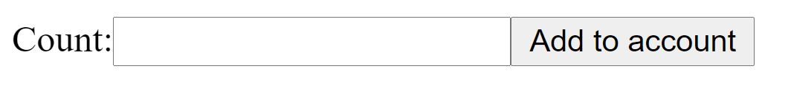

# React online marathon

## The tasks of the topic JSX 2:

### Create React Elements:
- `MyLabel` in *./src/components/my-label/my-label.js*, that return `label` tag with:
    - `for` attribute with value `inp-num`
    - `data-testid` attribute with value `element-label`
    - inner text `Count:`

- `MyInput` in *./src/components/my-input/my-input.js*, that return `input` tag with:
    - `id` attribute with value `inp-num`
    - `type` attribute with value `number`
    - `data-testid` attribute with value `element-input`

- `MyButton` in *./src/components/my-button/my-button.js*, that return `button` tag with:
    - `data-testid` attribute with value `element-button`    
    - inner text `Add to account`
